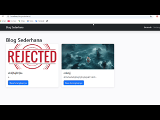

# Blog Sederhana - Modern PHP CMS Mini  #

✨ Kutipan
"Aku tidak berilmu; yang berilmu hanyalah DIA. Jika tampak ilmu dariku, itu hanyalah pantulan dari Cahaya-Nya."

## 🎥 Demo


**Blog Sederhana** adalah CMS mini berbasis PHP-MySQL dengan arsitektur modular dan tampilan elegan menggunakan Bootstrap 5. Dibangun untuk pembelajaran pengembangan web dengan fitur lengkap namun tetap sederhana.

## 🌟 Highlights

✔ Sistem autentikasi admin yang aman  
✔ Manajemen artikel CRUD dengan upload gambar  
✔ Generasi slug otomatis
✔ Tampilan responsif & modern  
✔ Arsitektur terorganisir dengan komponen reusable  
✔ Dilengkapi sistem keamanan dasar  

> "Ilmu tanpa amal seperti pohon tanpa buah."  
> *- Pepatah Islami -*

## 🛠️ Tech Stack


## 🚀 Fitur Utama

### 💻 Admin Panel
- Sistem login/logout admin
- Dashboard manajemen konten
- Perlindungan route dengan session

### 📝 Manajemen Artikel
- Buat, baca, edit, hapus artikel (CRUD)
- Auto-generate slug dari judul
- Upload gambar cover artikel
- Penanda waktu created/updated
- Status draft/published

### 🌐 Frontend
- Tampilan artikel responsive
- Desain modern dengan Bootstrap 5
- CSS custom untuk elegan tambahan
- Komponen modular (navbar, footer)

### ⚙️ Sistem Pendukung
- Fungsi utilitas global (slugify, dll)
- Konfigurasi terpusat
- Folder upload terproteksi

## 🛠️ Instalasi

### Prasyarat
- PHP ≥ 8.0
- MySQL ≥ 5.7
- Web server (Apache/Nginx)

### Langkah Setup

1. Clone repositori:
   ```bash
   git clone https://github.com/Alghifari888/blog_sederhana.git
   cd blog_sederhana
   ```

2. Setup database:
   ```sql
   CREATE DATABASE blog_sederhana;
   USE blog_sederhana;
   
   -- Jalankan SQL dari file schema.sql atau:
   CREATE TABLE users (
       id INT AUTO_INCREMENT PRIMARY KEY,
       username VARCHAR(50) NOT NULL,
       password VARCHAR(255) NOT NULL,
       email VARCHAR(100),
       created_at DATETIME DEFAULT CURRENT_TIMESTAMP
   );
   
   CREATE TABLE posts (
       -- (struktur tabel lengkap)
   );
   
   INSERT INTO users VALUES (1,'admin',PASSWORD('admin123'),'admin@example.com',NOW());
   ```

3. Konfigurasi:
   Edit `inc/config.php`:
   ```php
   define('DB_HOST', 'localhost');
   define('DB_USER', 'root');
   define('DB_PASS', '');
   define('DB_NAME', 'blog_sederhana');
   ```

4. Jalankan:
   - Letakkan di folder web server
   - Akses via browser:
     ```
     http://localhost/blog_sederhana/
     http://localhost/blog_sederhana/admin/login.php
     ```

## 🔒 Aspek Keamanan

- Validasi session untuk akses admin
- Proteksi XSS dengan `htmlspecialchars()`
- Filter upload file (hanya gambar)
- Password hashing
- Pembatasan akses folder upload

## 🖼️ Tampilan

| Halaman | Deskripsi |
|---------|-----------|
|  | Daftar artikel |
|  | Detail artikel |
|  | Form admin |
|  | Panel admin |

## 🤝 Berkontribusi

1. Fork project
2. Buat branch fitur (`git checkout -b fitur-baru`)
3. Commit perubahan (`git commit -m 'Tambahkan fitur'`)
4. Push ke branch (`git push origin fitur-baru`)
5. Buat Pull Request

## 📜 Lisensi

MIT License - Bebas digunakan, dimodifikasi, dan didistribusikan.

## ✨ Penghargaan

Dikembangkan dengan ❤ oleh [Alghifari888](https://github.com/Alghifari888)  
💡 Terinspirasi oleh kebutuhan CMS sederhana untuk pembelajaran

---

⭐ Jika project ini membantu, mohon beri star di GitHub!  
🔔 Pantau update terbaru untuk fitur-fitur baru!
```
